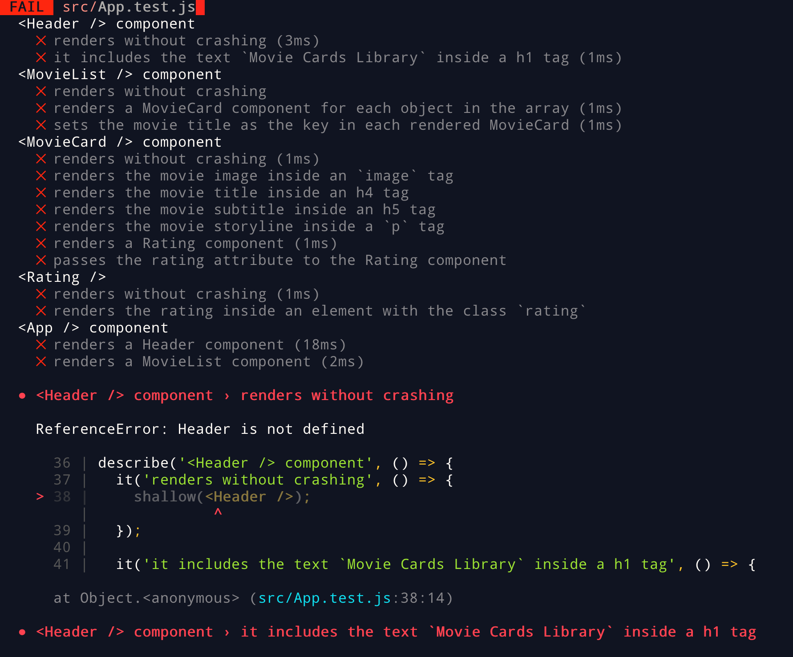
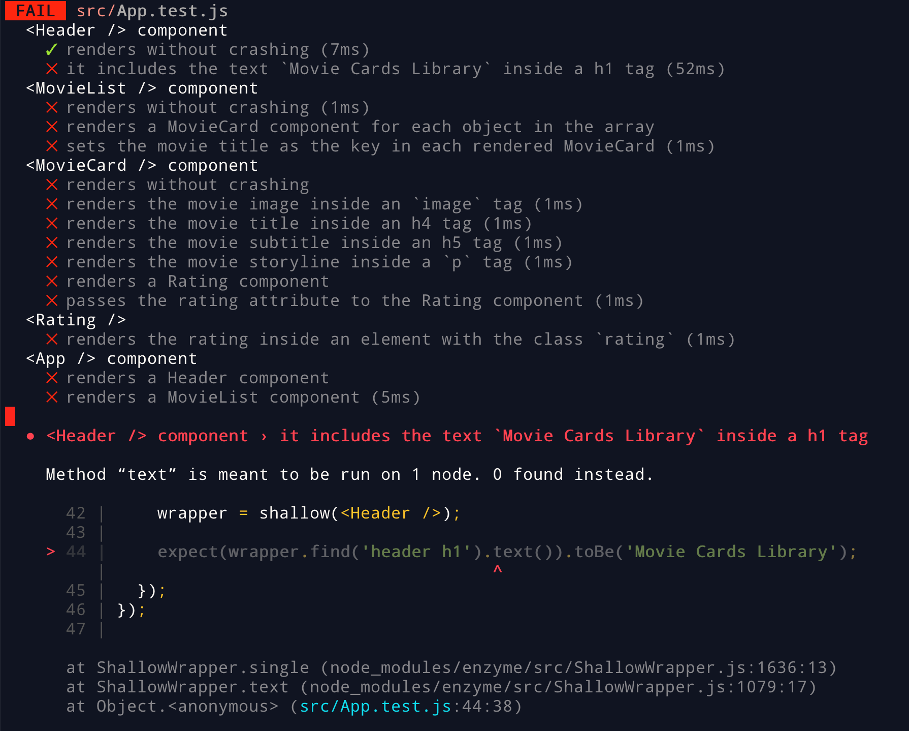
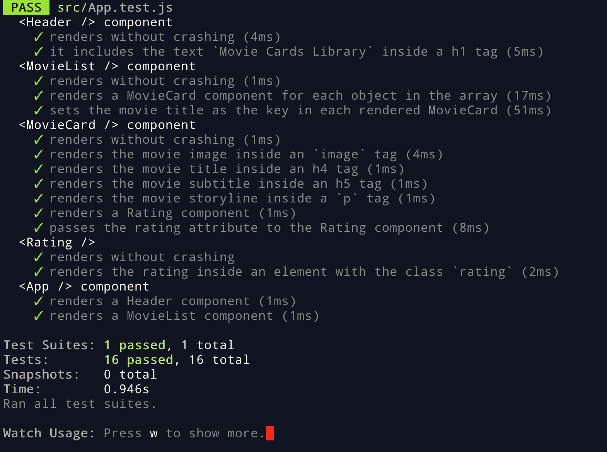
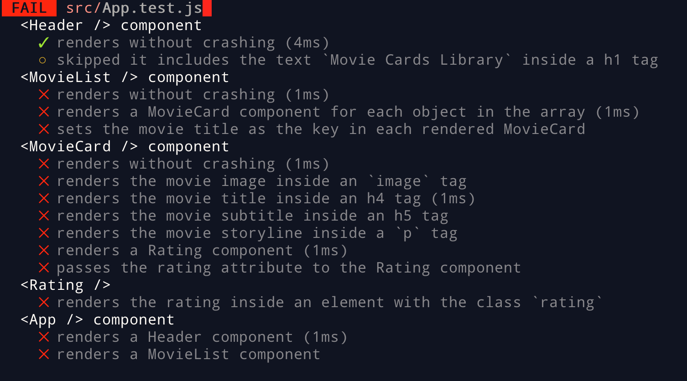

# Boas vindas ao repositório do projeto de Movie Cards Library!

Você já usa o GitHub diariamente para desenvolver os exercícios, certo? Agora, para desenvolver os projetos, você deverá seguir as instruções a seguir. Fique atento a cada passo, e se tiver qualquer dúvida, nos envie por _Slack_! #vqv 🚀

Aqui você vai encontrar os detalhes de como estruturar o desenvolvimento do seu projeto a partir desse repositório, utilizando uma branch específica e um _Pull Request_ para colocar seus códigos.

## O que deverá ser desenvolvido

Você deverá desenvolver uma biblioteca de cartões de filmes utilizando React. A biblioteca deverá possuir um cabeçalho e uma lista de cartões. Cada cartão representa um filme e possui uma imagem, título, subtítulo, sinopse e avaliação. A biblioteca deverá ser algo parecido com a imagem abaixo.


Você precisará implementar um conjunto de componentes em React que irão compor o seu App.

## Desenvolvimento e testes

Este repositório já contem um _template_ com um App React criado e configurado. Após clonar o projeto e instalar as dependências (mais sobre isso abaixo), você não precisará realizar nenhuma configuração adicional. Você deverá completar este _template_ implementando os requisitos listados na próxima seção.

Será necessário criar quatro componentes:

   - Header
   - MovieList
   - MovieCard
   - Rating

Cada componente representa uma parte específica do site, conforme ilustrado abaixo:


Todos os componentes devem ser criados dentro da pasta `src/components`. **É imporante que seus componentes tenham exatamente os nomes listados acima**.

Todos os requisitos do projeto serão testados automaticamente. Os testes para cada requisitos estão no arquivo `src/App.test.js`. Gaste um tempo lendo-o para entender como os testes estão organizados.

Para executar os testes localmente, digite no terminal o comando `npm test`. Inicialmente, seus testes estarão assim:



A primeira parte da saída mostra um sumário de cada teste e seu status. Um ❌ representa um teste falhando, enquanto um ✅ representa um teste correto. Naturalmente, no início todos os testes estarão falhando.

Abaixo do sumário, para cada teste falhando, há uma mensagem explicativa sobre o motivo que causou a falha do teste, assim como a linha em que a falha ocorreu. Na imagem, vamos que o teste falha porque o componente `Header`, utilizando na linha 38, não está definido.

Se fizemos uma implementação simples do componente `Header`, que não renderiza nada:

```jsx
import React from 'react';

class Header extends React.Component {
  render() {
  }
}

export default Header;
```

E descomentarmos a linha que importa o componente `Header` em `App.test.js`:

```js
// import App from './App';
import Header from './components/Header';
// import MovieCard from './components/MovieCard';
// import MovieList from './components/MovieList';
// import Rating from './components/Rating';
```

Veremos que o primeiro teste agora passa:



Quando seu projeto estiver terminado, todos os testes deverão estar passando:



#### Dica: desativanto testes

Especialmente no início, quando a maioria dos testes está falhando, a saída após executar os testes é bastante poluída. Você pode desabilitar temporariamente um teste utilizando a função `skip` junto à função `it`. Comno o nome indica, esta função "pula" um teste:

```js
it.skip('it includes the text `Movie Cards Library` inside a h1 tag', () => {
  wrapper = shallow(<Header />);

  expect(wrapper.find('header h1').text()).toBe('Movie Cards Library');
});
```

Na saída da execução dos testes, você verá um  indicando que o teste está sendo pulado:



Uma estratégia é pular todos os testes no início e ir implementando um teste de cada vez, removendo dele a função `skip`.

⚠️ Lembre-se não entregar o projeto com nenhum teste ignorado. Testes ignoradados serão tratados como testes falhando.

#### Dica: watch mode

Ao executar os testes localmente, [Jest](https://jestjs.io/), a ferramente que executa os testes, entra em _watch mode_. Nesse modo, a cada vez um arquivo é salvo, os testes são executados novamente. Isso pode aumentar sua produtividade removendo a necessidade de executar os testes manualmente o tempo todo. Você pode abrir uma aba no seu terminal ou no terminal do _VSCode_ e deixar o _Jest_ rodando nesse modo.

## Requisitos do projeto

⚠️ Lembre-se que o seu projeto só será avaliado se estiver passando pelos _checks_ do **CodeClimate** e do **TravisCI**

##### 1 Crie um componente chamado Header

Esse componente representará o o cabeçalho da página.

##### 2 Renderize o texto "Movie Cards Library" dentro de Header

O texto deverá estar dentro de uma tag `h1`, que por usa vez deve estar dentro de uma tag `header`.

##### 3 Crie um componente chamado `MovieList`

Este componente representará toda a área com os cartões de filmes. `MoveList` deve receber uma prop `movies`, que é um array de objetos com informações de um filme.

##### 4 Renderize componentes MovieCard dentro de MovieList

`MovieList` deve renderizar um componente `MovieCard` para cada objeto contido no array recebido na prop `movies`.

##### 5 Passe uma key para cada MovieCard renderizado

`MovieList` deve renderizar `MovieCard`s de forma dinâmica. Ou seja, deve utilizar a função `map` para renderizar uma lista. Cada componente `MovieCard` deve receber uma prop `key` com o nome do filme.

##### 6 Crie um componente chamado MovieCard

Esse componente representa um cartão de filme. `MovieCard` deve receber uma prop `movies`. Essa prop será um objeto, contendo as propriedades, `title`, `subtitle`, `storyline`, `imagePath` e `rating`.

##### 7 Renderize a imagem do filme

`MovieCard` deve renderizar uma tag `img`, tendo como atributo `src` o valor da propriedade `imagePath` do objeto recebido como prop.

##### 8 Renderize o título do filme

`MovieCard` deve renderizar o título do filme dentro de uma tag `h4`. O título está contido na propriedade `title` do objeto recebido como prop.

##### 9 Renderize o subtítulo do filme

`MovieCard` deve renderizar o subtítulo do filme dentro de uma tag `h5`. O subtítulo está contido na propriedade `subtitle` do objeto recebido como prop.

##### 10 Renderize a sinopse do filme

`MovieCard` deve renderizar a sinopse do filme dentro de uma tag `p`. A sinopse está contida na propriedade `storyline` do objeto recebido como prop.

##### 11 Renderize um componnete `Rating`

`MovieCard` deve renderizar um componente `Rating`.

##### 12 Passe como prop para o componente `Rating` o atributo `rating`

`MovieList` deve passar para o componente `Rating` uma prop chamada `rating`. O valor dessa prop é a propriedade `rating` do objeto recebido na prop `movie`.

##### 13 Crie um componente chamado `Rating`

Esse componene representa a avaliação de um filme.

##### 14 Renderize a nota de um filme dentro de Rating

`Rating` deve renderizar a nota do filme recebido na prop `rating` dentor de um elemento com a classe `rating`.

##### 15 App deve renderizar Header

O componente `App` deve renderizar um componente `Header`.

##### 16 App deve renderizar MovieList

O componente `App` deve renderizar um componente `MovieList`, passando como prop `movies` a lista de filmes contida no arquivo `data.js`. Para isso, você precisará importar `data.js` dentro de `App.js`.
